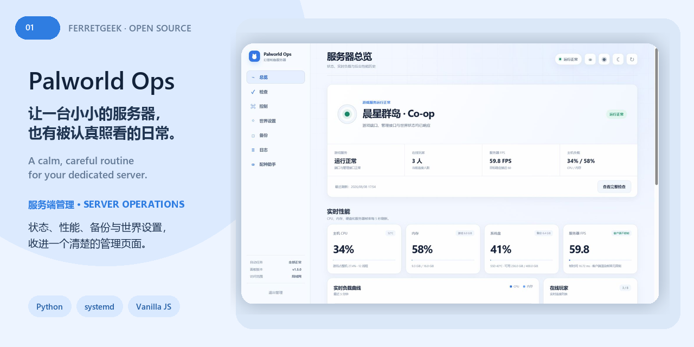

<p align="center">
  
</p>

# Palworld Ops

[](https://github.com/ferretgeek/PalworldOps/actions/workflows/ci.yml)
[](https://www.python.org/)
[](https://systemd.io/)
[](./LICENSE)

**让一台自托管游戏服务器，也拥有清楚、克制、可恢复的日常管理。**

Palworld Ops 是面向现有 Linux Palworld Dedicated Server 的管理层：一个无第三方 Python 依赖的 Web 面板、一套安全运维命令，以及经过资源限制的 systemd 自动化。它不会替你隐藏风险——停服、更新、设置和恢复都保留在线玩家检查、保存、备份、校验与回滚边界。

**A calm, recoverable control layer for an existing Linux Palworld dedicated server.** It combines a dependency-free web dashboard, a guarded CLI, verified backups, health checks, safe updates, and bounded systemd automation.

> 非官方社区项目，与 Pocketpair 没有隶属、授权或背书关系。Palworld 及相关名称归其权利人所有。 / Unofficial community project. Not affiliated with or endorsed by Pocketpair.

## 界面 / Interface

<p align="center">
  
</p>

预览使用完全合成的数据，不含真实主机名、玩家、地址、世界 ID、备份名或日志。 / The preview uses synthetic data only—no real host, player, address, world ID, backup name, or log.

## 能做什么 / What it does

- **一眼看懂 / Operational clarity** — 服务、在线人数、服务器 FPS、CPU、内存、磁盘、网络与温度集中呈现。
- **安全控制 / Guarded actions** — 保存、备份、启停、重启、广播和更新都有在线检查与明确进度。
- **可验证备份 / Verified backups** — 日、周、月、事件、手动和更新前备份，带成员清单、哈希、容量上限与恢复演练。
- **世界设置 / World settings** — 分类编辑 `PalWorldSettings.ini`，高风险字段保持保护，应用前先保存和备份。
- **诊断与历史 / Diagnostics and history** — 性能曲线、运维事件、健康检查、日志、诊断包和 CSV 导出。
- **自动化 / Automation** — systemd 健康、更新、维护与备份任务均有 CPU、I/O、内存和磁盘边界。

## 适用边界 / Scope

这不是 Palworld 服务端的一键安装器。它假设你已经在 Linux 上安装了官方专用服务器，并愿意采用 `/opt/palworld` 目录约定。默认设计面向内网或 VPN；不要把面板或 REST API 直接暴露到公网。

This is not a one-click Palworld server installer. It is a management layer for an existing native Linux deployment, using `/opt/palworld` by default and intended for a trusted LAN or VPN.

## 快速开始 / Quick start

要求 Ubuntu 22.04/24.04 或同类 systemd Linux、Python 3.10+、SteamCMD 与已安装的 Palworld Dedicated Server。

```bash
sudo install -d -m 0755 /opt/palworld/bin /opt/palworld/panel /opt/palworld/secrets /opt/palworld/state
sudo install -m 0755 palworldctl.py /opt/palworld/bin/palworldctl
sudo install -m 0755 palworld-panel.py /opt/palworld/bin/palworld-panel
sudo cp -a panel/. /opt/palworld/panel/
sudo install -m 0600 .env.example /etc/palworld-ops.env
sudo sh -c 'umask 077; printf "%s" "REPLACE_WITH_A_STRONG_PASSWORD" > /opt/palworld/secrets/admin-password'
```

逐项核对 `.service` 与 `.timer` 中的路径和资源上限，再安装需要的单元：

```bash
sudo install -m 0644 palworld.service palworld-panel.service /etc/systemd/system/
sudo install -m 0644 palworld-health.* palworld-update.* /etc/systemd/system/
sudo install -m 0644 palworld-backup-* palworld-maintenance.* /etc/systemd/system/
sudo systemctl daemon-reload
sudo systemctl enable --now palworld.service palworld-panel.service
sudo systemctl enable --now palworld-health.timer palworld-update.timer
```

面板默认监听 `0.0.0.0:8213`。先用防火墙限制到受信任网段，再访问 `http://SERVER_IP:8213`；账号为 `admin`，密码来自 `/opt/palworld/secrets/admin-password`。

The panel listens on `0.0.0.0:8213` by default. Restrict it to a trusted subnet before opening `http://SERVER_IP:8213`. The username is `admin`; the password comes from `/opt/palworld/secrets/admin-password`.

## 日常命令 / Daily commands

```bash
sudo /opt/palworld/bin/palworldctl status
sudo /opt/palworld/bin/palworldctl health
sudo /opt/palworld/bin/palworldctl api players
sudo /opt/palworld/bin/palworldctl backup create --kind manual
sudo /opt/palworld/bin/palworldctl backup verify latest
sudo /opt/palworld/bin/palworldctl update          # check only
sudo /opt/palworld/bin/palworldctl update --apply  # save, back up, then update
```

恢复默认只演练；`--apply` 会覆盖活动世界并丢失备份时间之后的进度。

Restore is a dry run by default. `--apply` overwrites the active world and discards progress made after the selected backup.

## 验证 / Verification

```bash
python3 -m py_compile palworldctl.py palworld-panel.py
node --check panel/panel.js
bash -n backup-after-stop.sh
```

Windows 可以完成语法与前端检查，但 systemd、权限、SteamCMD、实际保存/备份/恢复和游戏进服必须在目标 Linux 环境验证。

Windows can validate syntax and the front end; systemd, permissions, SteamCMD, real saves, backups, restores, and game joins must be tested on the target Linux host.

## 安全 / Security

- 不要提交 `/opt/palworld/secrets`、存档、数据库、备份、会话、诊断包或日志。
- 不要在玩家在线时停服、更新、恢复或应用需要重启的设置。
- 生产部署应限制可信网段；需要远程访问时使用 VPN 或经过鉴权的 HTTPS 入口。
- 安全问题请阅读 [SECURITY.md](./SECURITY.md)。

## 技术 / Stack

`Python stdlib` · `HTML` · `CSS` · `JavaScript` · `SQLite` · `systemd` · `SteamCMD`
